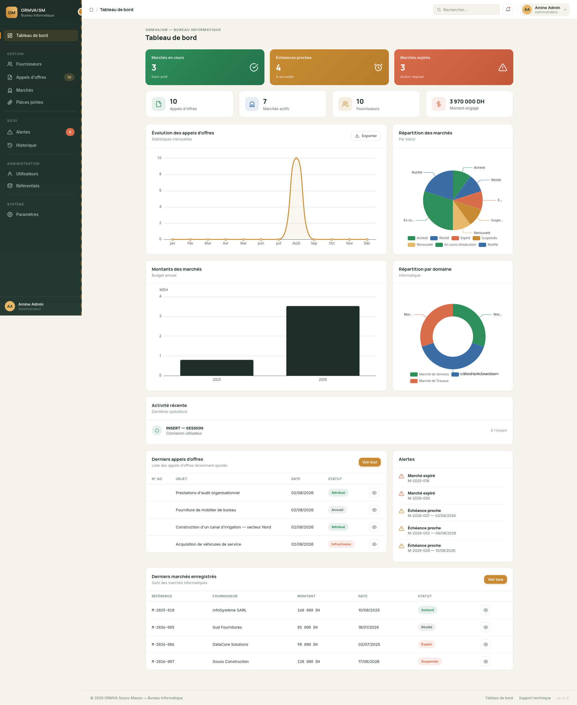
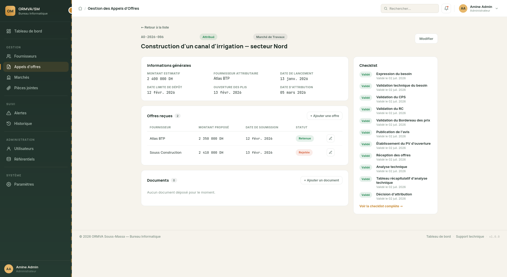
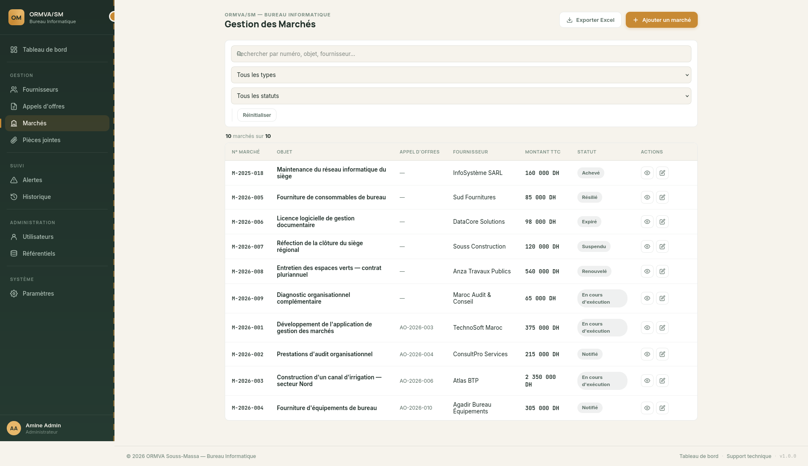

# Gestion-AO-Marchés

**Application interne de gestion des appels d'offres et des marchés publics**
*ORMVA/SM — Office Régional de Mise en Valeur Agricole du Souss-Massa · Bureau Informatique*


---

## 📋 Sommaire

- [À propos](#-à-propos)
- [Fonctionnalités](#-fonctionnalités)
- [Stack technique](#-stack-technique)
- [Architecture](#-architecture)
- [Rôles & accès](#-rôles--accès)
- [Démarrage rapide](#-démarrage-rapide)
- [Structure du projet](#-structure-du-projet)
- [Documentation](#-documentation)

---

## 🏛 À propos

<div style="display: flex; gap: 15px; overflow-x: auto; white-space: nowrap; padding: 10px; border: 1px solid #30363d; border-radius: 6px;">
  
<!-- 
    
     
-->

</div>


**Gestion-AO-Marchés** est une application web interne développée pour digitaliser et centraliser le suivi du cycle de vie complet des marchés publics informatiques au sein du Bureau Informatique de l'ORMVA/SM — depuis le lancement d'un **appel d'offres** jusqu'à la **réception définitive** du marché correspondant.

Le projet couvre l'ensemble du workflow métier : appels d'offres, offres des fournisseurs, attribution, marchés, checklists de suivi administratif, gestion documentaire, et traçabilité complète des actions via un journal d'audit.

> Développé dans le cadre d'un stage d'ingénierie logicielle, en réponse à un cahier des charges (CDC) couvrant les exigences fonctionnelles **F01 à F12**.


## ✨ Fonctionnalités

| Module | Description |
|---|---|
| 📢 **Appels d'offres** | Cycle de vie complet — brouillon → publication → ouverture des plis → évaluation → attribution / infructueux / annulé |
| 📨 **Offres** | Réception et évaluation des offres fournisseurs par appel d'offres, avec statuts (reçue, admissible, rejetée, retenue) |
| 📄 **Marchés** | Suivi contractuel — notification, exécution, réceptions provisoire/définitive, renouvellement, résiliation |
| 🏢 **Fournisseurs** | Répertoire des fournisseurs par domaine d'activité, avec activation/désactivation |
| ✅ **Checklists** | Suivi administratif étape par étape, généré automatiquement à la création — étapes distinctes pour les AO et pour les marchés |
| 📎 **Pièces jointes** | Dépôt sécurisé de documents (PDF, Word, Excel, images), typés selon le contexte AO ou marché |
| 🔔 **Alertes** | Marchés expirés, échéances proches (30 jours) et échéances à venir, avec code couleur par urgence |
| 📊 **Tableau de bord** | Vue d'ensemble en temps réel — montants engagés, répartition par statut, budget annuel, derniers AO |
| 🕓 **Historique** | Journal d'audit complet — qui a fait quoi, quand, avec le détail champ par champ (ancienne → nouvelle valeur) |
| ⚙️ **Référentiels** | Gestion centralisée de toutes les listes déroulantes du système (statuts, types, étapes...) sans toucher au code |
| 👤 **Utilisateurs** | Gestion des comptes et des rôles (réservée aux administrateurs) |
| 📤 **Export** | Génération de fiches PDF et d'exports Excel |

## 🛠 Stack technique

**Backend**
- [Node.js](https://nodejs.org/) & [Express](https://expressjs.com/) — serveur et routage (architecture MVC)
- [MySQL](https://www.mysql.com/) via [`mysql2`](https://www.npmjs.com/package/mysql2) — base de données relationnelle
- [`express-session`](https://www.npmjs.com/package/express-session) + [`express-mysql-session`](https://www.npmjs.com/package/express-mysql-session) — sessions persistées en base (survit aux redémarrages du serveur)
- [`bcrypt`](https://www.npmjs.com/package/bcrypt) — hachage des mots de passe
- [`multer`](https://www.npmjs.com/package/multer) — upload sécurisé de fichiers
- [`pdfkit`](https://www.npmjs.com/package/pdfkit) / [`exceljs`](https://www.npmjs.com/package/exceljs) — génération d'exports PDF / Excel

**Frontend**
- [EJS](https://ejs.co/) — templating serveur
- [Bootstrap 5](https://getbootstrap.com/) & [Bootstrap Icons](https://icons.getbootstrap.com/)
- [ECharts](https://echarts.apache.org/) — graphiques du tableau de bord

## 🏗 Architecture

Le projet suit une architecture **MVC** stricte :

```
Route  →  Middleware (auth / rôle / audit)  →  Contrôleur  →  Modèle (SQL)  →  Vue (EJS)
```

**Principe de conception clé** — toutes les colonnes de statut/type dans la base de données (`statut_marche`, `type_document`, `etape_checklist`, etc.) sont des clés étrangères vers une table unique `referentiels`, plutôt que des `ENUM` figés. Cela permet à un administrateur de faire évoluer les listes du système directement depuis l'interface, sans jamais toucher au code.

## 🔐 Rôles & accès

| Rôle | Accès |
|---|---|
| **ADMIN** | Accès complet — y compris gestion des utilisateurs et des référentiels |
| **GESTIONNAIRE** | Création et gestion des AO, marchés, fournisseurs, offres, documents |
| **CONSULTANT** | Consultation seule, sans droit de modification |

> Note : la suppression définitive des appels d'offres et des marchés est volontairement **désactivée pour tous les rôles**, y compris ADMIN — la traçabilité réglementaire des marchés publics l'exige. Le changement de statut (`Annulé`, `Résilié`, `Expiré`...) fait office d'archivage.

## 🚀 Démarrage rapide

```bash
# 1. Cloner et installer
git clone https://github.com/Kardaoui-Bellal/Gestion-AO-Marches.git
cd Gestion-AO-Marches
npm install

# 2. Configurer l'environnement
cp .env.example .env
# → éditez .env avec vos identifiants MySQL

# 3. Créer la base et importer le schéma
mysql -u root -p -e "CREATE DATABASE ormvasm_ao_marches CHARACTER SET utf8mb4;"
mysql -u root -p ormvasm_ao_marches < database/database.sql
mysql -u root -p ormvasm_ao_marches < database/referentiels_seed.sql

# 4. Peupler avec des données de démonstration (optionnel mais recommandé)
node database/seedDemo.js

# 5. Démarrer
npm run dev   # développement
npm start     # production
```

L'application est accessible sur **http://localhost:3000**.

📖 Guide détaillé, dépannage, et variables d'environnement : [`docs/INSTALL.md`](docs/INSTALL.md)
🌱 Détail des scripts de seed et identifiants de démonstration : [`docs/SEED_DATA.md`](docs/SEED_DATA.md)

## 📁 Structure du projet

```
Gestion-AO-Marches/
├── config/                  # Connexion DB, session, upload (multer)
├── database/                # Schéma SQL, seeds, script de démo
├── docs/                    # Documentation technique détaillée
├── public/                  # Assets statiques (CSS, JS, images)
├── src/
│   ├── controllers/         # Logique métier par entité
│   ├── middlewares/         # Auth, rôles, audit, gestion d'erreurs
│   ├── models/               # Accès aux données (SQL brut via mysql2)
│   ├── routes/                # Définition des routes Express
│   ├── utils/                  # Fonctions utilitaires partagées
│   └── app.js                   # Point d'entrée Express
├── views/                    # Templates EJS, organisés par entité
├── uploads/                  # Fichiers déposés (AO / marchés)
└── server.js                 # Démarrage du serveur
```

## 📚 Documentation

Une documentation technique plus détaillée est disponible dans le dossier [`docs/`](docs/) :

| Document | Description |
|---|---|
| [`INSTALL.md`](docs/INSTALL.md) | Guide d'installation détaillé |
| [`DATABASE.md`](docs/DATABASE.md) | Schéma de base de données et choix de conception |
| [`ARCHITECTURE.md`](docs/ARCHITECTURE.md) | Architecture MVC, organisation du projet, référentiels, rôles |
| [`SEED_DATA.md`](docs/SEED_DATA.md) | Scripts de seed et jeu de données de démonstration |
| [`API.md`](docs/API.md) | Référence complète des routes |

Autres ressources utiles :

- [`database/database.sql`](database/database.sql) — schéma de base de données complet
- [`database/referentiels_seed.sql`](database/referentiels_seed.sql) — données de référence
- Rapport de stage (`rapport.pdf`) — analyse fonctionnelle, conception, réalisation et documentation utilisateur

---

<p align="center">
  <sub>Projet réalisé dans le cadre d'un stage au sein du Bureau Informatique — ORMVA/SM</sub>
</p>
