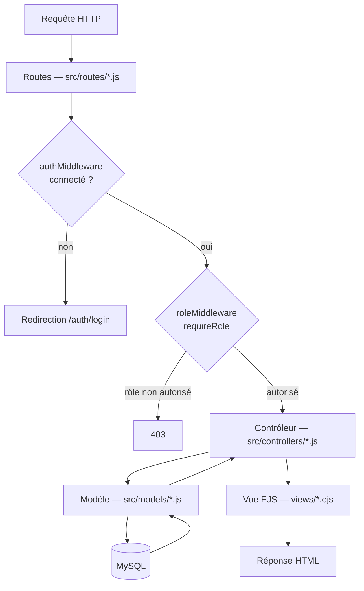

# Architecture

## Flux d'une requête



Chaque couche a une responsabilité unique et ne déborde pas sur les autres :

| Couche | Rôle | Ne fait pas |
|---|---|---|
| **Routes** (`src/routes/`) | Déclare les endpoints et la chaîne de middlewares par route | Aucune logique métier |
| **Middlewares** (`src/middlewares/`) | Authentification, autorisation par rôle, gestion d'erreurs (upload) | Pas d'accès direct aux modèles |
| **Contrôleurs** (`src/controllers/`) | Valide les entrées, orchestre les appels aux modèles, choisit la vue | Pas de SQL direct |
| **Modèles** (`src/models/`) | Requêtes SQL préparées via `mysql2/promise` | Pas de logique de présentation |
| **Vues** (`views/`) | Rendu HTML via EJS | Pas d'accès direct à la base |

## Organisation des dossiers

```
Gestion-AO-Marches/
├── config/              # Connexion DB (db.js), session (session.js), upload (multer.js)
├── database/            # Schéma SQL, seed admin, seed de démonstration
├── docs/                # Cette documentation
├── public/               # Assets statiques — CSS, JS client, images
├── src/
│   ├── controllers/      # Un contrôleur par entité métier
│   ├── middlewares/       # authMiddleware, roleMiddleware, errorHandler, historiqueMiddleware
│   ├── models/              # Un modèle par entité, requêtes SQL brutes
│   ├── routes/               # Un fichier de routes par entité, monté dans app.js
│   ├── utils/                  # helpers.js (formatage, buildDiff...), logger.js, validators.js
│   └── app.js                   # Configuration Express, montage des routes, middlewares globaux
├── uploads/               # Fichiers déposés (séparés par ao/ et marches/)
├── views/                  # Templates EJS, un dossier par entité
└── server.js                # Point d'entrée — connexion DB puis démarrage du serveur
```

**Note sur les vues** — chaque page est un document HTML autonome (`<!doctype html>` complet), pas un layout partagé via `express-ejs-layouts`. Les fragments communs (`sidebar`, `navbar`, `footer`) sont réutilisés via `<%- include('../layouts/partials/...') %>` dans chaque vue.

## Référentiels

Toutes les listes de valeurs du système (statuts, types, rôles, étapes) sont centralisées dans une seule table `referentiels`, identifiée par `(type_referentiel, code)` plutôt que par des `ENUM` — voir [`DATABASE.md`](DATABASE.md#choix-de-conception) pour la justification.

| `type_referentiel` | Codes |
|---|---|
| `ROLE` | `ADMIN`, `GESTIONNAIRE`, `CONSULTANT` |
| `DOMAINE_ACTIVITE` | `TRAVAUX`, `FOURNITURES`, `IT`, `SERVICES` |
| `CATEGORIE_AO` | `TRAVAUX`, `FOURNITURES`, `SERVICES` |
| `ETAT_AO` | `BROUILLON`, `PUBLIE`, `OUVERTURE_PLIS`, `EN_EVALUATION`, `ATTRIBUE`, `INFRUCTUEUX`, `ANNULE` |
| `STATUT_OFFRE` | `RECUE`, `ADMISSIBLE`, `REJETEE`, `RETENUE` |
| `TYPE_MARCHE` | `CADRE`, `FERME`, `RECONDUCTIBLE` |
| `STATUT_MARCHE` | `NOTIFIE`, `EN_COURS`, `SUSPENDU`, `ACHEVE`, `RESILIE`, `RENOUVELE`, `EXPIRE` |
| `ETAPE_CHECKLIST_AO` | `EXPR_BESOIN`, `VALID_TECH`, `VALID_CPS`, `VALID_RC`, `VALID_BP`, `PUB_AVIS`, `PV_OUVERTURE`, `REC_OFFRES`, `ANALYSE_TECH`, `T_RECAP_AT`, `ATTRIBUTION` |
| `ETAPE_CHECKLIST_MARCHE` | `NOTIF`, `OS_DEBUT`, `RECEPT_PROV`, `RECEPT_DEF` |
| `STATUT_CHECKLIST` | `TODO`, `WIP`, `DONE`, `BLOCKED`, `NA` |
| `TYPE_DOCUMENT_AO` | `CPS`, `RC`, `BORDEREAU_PRIX`, `PV`, `ATTESTATION`, `AVIS_AO`, `CORRESPONDANCE`, `AUTRE` |
| `TYPE_DOCUMENT_MARCHE` | `CONTRAT`, `OS`, `FACTURE`, `BON_LIVRAISON`, `ATT_GARANTIE`, `DECOMPTE`, `PV_RP`, `PV_RD`, `CORRESPONDANCE`, `AUTRE` |

> Les checklists et les types de document sont volontairement séparés entre AO et Marché (`_AO` / `_MARCHE`) — un AO et un marché ne partagent ni les mêmes étapes administratives, ni les mêmes types de pièces jointes.

Un enregistrement de référentiel a un champ `actif` : les listes déroulantes de création filtrent sur `actif = 1`, mais un enregistrement existant conserve l'affichage de sa valeur même si elle est désactivée après coup.

## Rôles et permissions

| Module | ADMIN | GESTIONNAIRE | CONSULTANT |
|---|:---:|:---:|:---:|
| Appels d'offres — consulter | ✅ | ✅ | ✅ |
| Appels d'offres — créer / modifier / attribuer | ✅ | ✅ | ❌ |
| Marchés — consulter | ✅ | ✅ | ✅ |
| Marchés — créer / modifier / changer statut | ✅ | ✅ | ❌ |
| Fournisseurs — consulter | ✅ | ✅ | ✅ |
| Fournisseurs — créer / modifier | ✅ | ✅ | ❌ |
| Documents — consulter / télécharger | ✅ | ✅ | ✅ |
| Documents — déposer / archiver | ✅ | ✅ | ❌ |
| Checklist — consulter | ✅ | ✅ | ✅ |
| Checklist — modifier une étape | ✅ | ✅ | ❌ |
| Alertes / Tableau de bord | ✅ | ✅ | ✅ |
| Référentiels | ✅ | ❌ | ❌ |
| Utilisateurs | ✅ | ❌ | ❌ |
| Historique (audit) | ✅ | ❌ | ❌ |

Appliqué route par route via `requireRole(...roles)` (`src/middlewares/roleMiddleware.js`). Référence complète des routes et de leurs rôles autorisés : [`API.md`](API.md).

## Journal d'audit

Plutôt qu'un middleware générique, chaque contrôleur appelle directement `Historique.log({...})` après une opération significative. Pour les mises à jour multi-champs, `buildDiff(before, after, fields)` (`src/utils/helpers.js`) compare chaque champ individuellement et ne consigne que ceux réellement modifiés — un historique n'affiche donc jamais un champ resté identique, et jamais l'enregistrement entier sérialisé en JSON.