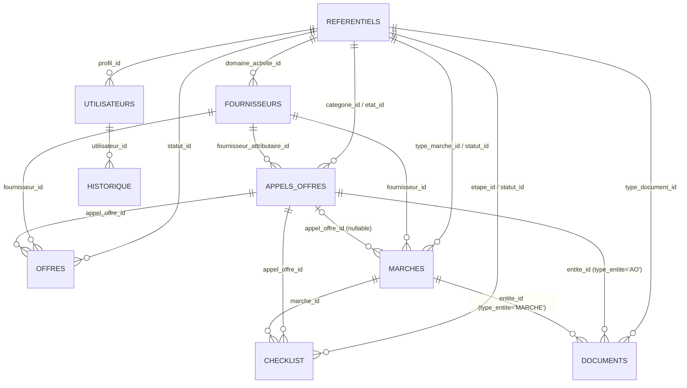

# Base de données

L'application utilise **MySQL** (8.x), accédé via le driver `mysql2/promise` avec des requêtes préparées.

Schéma SQL brut disponible dans [`database/database.sql`](../database/database.sql) — ce document en explique la conception plutôt que de le reproduire.

## Entités principales

| Table | Rôle |
|---|---|
| `utilisateurs` | Comptes de connexion (un rôle par utilisateur) |
| `fournisseurs` | Répertoire des prestataires |
| `appels_offres` | Appels d'offres (phase de consultation) |
| `offres` | Offres soumises par les fournisseurs sur un AO |
| `marches` | Marchés (phase contractuelle / exécution) |
| `checklist` | Étapes de suivi administratif, rattachées à un AO ou un marché |
| `documents` | Pièces jointes déposées, rattachées à un AO ou un marché |
| `referentiels` | Table unique regroupant toutes les listes de valeurs du système |
| `historique` | Journal d'audit de toutes les actions |

## Diagramme relationnel (simplifié)

> GitHub affiche automatiquement les diagrammes Mermaid dans les fichiers `.md` — aucun outil externe requis pour le visualiser.

## Choix de conception

### Table de référentiels plutôt que des `ENUM`

Aucune colonne de statut ou de type n'utilise `ENUM`. À la place, toutes pointent vers une table unique `referentiels`, identifiée par le couple `(type_referentiel, code)`. Ce choix permet à un administrateur de faire évoluer les listes du système (ajouter un statut, désactiver un type de document...) directement depuis l'interface, sans migration de schéma ni déploiement de code.

Détail complet des types de référentiels et de leurs codes : voir [`ARCHITECTURE.md`](ARCHITECTURE.md#référentiels).

### Archivage par statut plutôt que suppression

Les appels d'offres et les marchés ne peuvent jamais être supprimés physiquement — y compris par un administrateur. Un changement de statut (`ANNULE`, `RESILIE`, `EXPIRE`...) fait office d'archivage. Ce choix est dicté par une contrainte métier réelle : la traçabilité des marchés publics doit être intégralement préservée.

### Contraintes de clé étrangère

Toutes les relations sont déclarées avec des contraintes `FOREIGN KEY` explicites (`ON UPDATE CASCADE ON DELETE RESTRICT` sur la plupart des relations vers `referentiels`), empêchant la suppression accidentelle d'une valeur de référence encore utilisée, et la création d'enregistrements orphelins.

Cas particulier : `checklist.marche_id` et `checklist.appel_offre_id` sont tous deux nullables — une ligne de checklist appartient soit à un AO, soit à un marché, jamais aux deux, selon la colonne `type_entite`.

### Association polymorphique pour les documents

`documents` n'a pas deux colonnes FK séparées (`appel_offre_id` / `marche_id`) mais une paire `(type_entite, entite_id)` — `type_entite` valant `'AO'` ou `'MARCHE'`. Ce n'est pas une contrainte FK physique (impossible à exprimer proprement en SQL standard pour une association polymorphique), la cohérence est garantie applicativement au niveau du contrôleur.

### Journalisation d'audit

Chaque création/modification significative écrit une ligne dans `historique`, avec le nom du champ modifié et ses valeurs avant/après quand c'est pertinent — voir [`ARCHITECTURE.md`](ARCHITECTURE.md#journal-daudit) pour le détail du mécanisme.

### Unicité métier

Quelques contraintes `UNIQUE` traduisent directement des règles métier plutôt qu'une simple bonne pratique technique :
- `offres.(appel_offre_id, fournisseur_id)` — un fournisseur ne peut soumettre qu'une seule offre par appel d'offres.
- `fournisseurs.ice` — un ICE (Identifiant Commun de l'Entreprise) identifie un fournisseur de manière unique.
- `appels_offres.numero_ao` / `marches.numero` — chaque référence est unique dans le système.